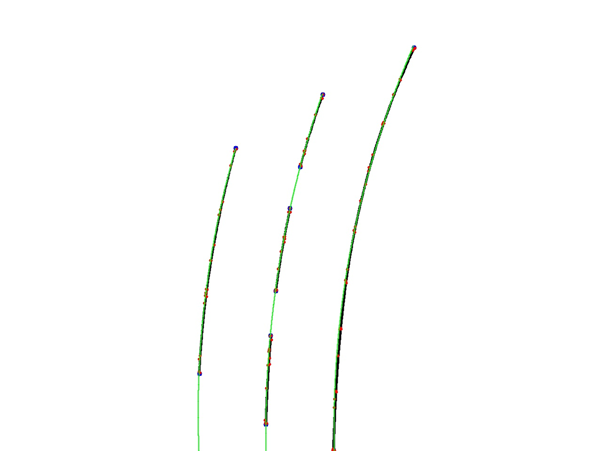
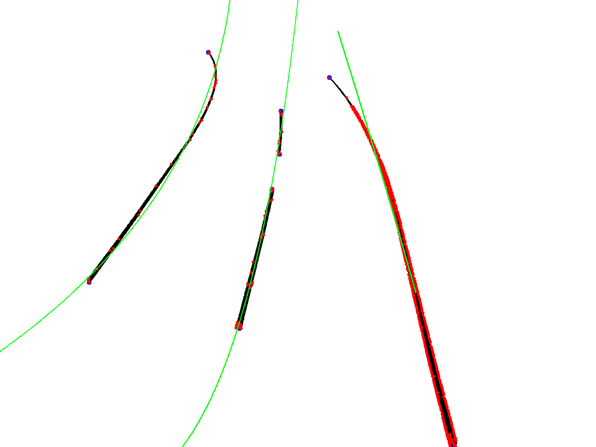

# Lane Regression/Assist 2020

### Components
* Lane Regression (current editor: [Yannik Motzet (TIT17)](mailto:yannik.motzet@outlook.com))
* Lane Assist (current editor: Inci Sahin)

## Getting started
### How to clone
* clone repository to your ROS workspace: ``` ~/catkin_ws/scr$: git clone https://gitlab.com/zfinnolab/laneregression/laneregression ```
* clone Lane Detection repo to your ROS workspace (check for requirements!): ```~/catkin_ws/scr$: git clone https://gitlab.com/zfinnolab/lane-detection-assist/detectionlane.git```

### Requirements
to get required python packages run: ```~/catkin_ws$: pip install -r requirements.txt ```

### How to build
* build the project: ``` ~/catkin_ws$: catkin_make ```
* ``` ~/catkin_ws$: source devel/setup.bash ```

### How to run
#### start all (detection/regression/assist) with launchfile
* ```~/catkin_ws/$: source devel/setup.bash ```

intput for detection from video:
* ```~/catkin_ws/$: roslaunch lane_keeping_assist all_video.launch ```
 
input for detection from camera:
* ```~/catkin_ws/$: roslaunch lane_keeping_assist all_camera.launch ```

#### start single nodes manually:
* start roscore: ```~/catkin_ws/$: roscore ```  
for each step open new terminal and first paste ``` source devel/setup.bash ``` in ``` /catkin_ws$ ```
* dummy lanedetection: ``` ~/catkin_ws$: rosrun lane_keeping_assist lanedetection_dummy.py ``` 
* ``` ~/catkin_ws$: rosrun lane_keeping_assist laneregression.py ```
* ``` ~/catkin_ws$: rosrun lane_keeping_assist laneassist.py ```


## Other things
### Get sample videos
* TruckMaker video: [Spurerkennungssimulation.avi](https://drive.google.com/open?id=1Fd3jdyYO9kUJk1QslhRScMUqpeO-pjwe)
* Lab video: [capture_webcam_lab.avi](https://drive.google.com/file/d/1PhBOzQwyuuEcxeehWBJXEhRqIL0cKGOF/view?usp=sharing)

Save in: ``` ~/catkin_ws/scr/detection ```

### How to: IPGMovie --> webcam
* use Capture Card (Mira Box)
* use [v4l2loopback](https://github.com/umlaeute/v4l2loopback) + [OBS](https://obsproject.com/de) (install v4l2loopback, install OBS, run ```sudo modprobe v4l2loopback```, in OBS: tools -> V4L2 Video output)
* use [v4l2loopback](https://github.com/umlaeute/v4l2loopback) + shell script (install  v4l2loopback, run ```./tools/screen_capture.sh```)

### Test UDP messages to TruckMaker/Truck
with ```\tools\send_udp.py``` you can send a steering angle to TM (go sure that IP is correct)


## How it works
### How LaneRegressions works

####Lane Detection dummy:  
(bevore Lane Detection wasn't finished a dummy Lane Detection was used for puublishing data)  
* in the original Lane Detection software an algorithm for Persepctive Transformation was implemented (to get the top-down view)
* the cluster points of a few frames were written to a file
* a dummy publisher retrieve test points from the file and publishes successively the frames with the all clusterpoints on a topic
* the actual reduction of points with cv2.polydp() (Ramer–Douglas–Peucker algorithm) was run in Lane Regression alfter cluster_lane_segments (this code part still exists in Lane Regression but is switched of)

####Lane Regression:
* subscribe to topic
* look for related cluster (dashed line consists of several clusters)
* order new points
* calculate x(t) and y(t) functions (third degree polynomials)
* get order of functions and look for border lines
* calculate ideal line and offset
* publish offset on a topic

####Lane Assist:
* subscribe to topic
* with offset calculate steering angle
* send a UDP message to Arduino with steering angle and speed

### Result example

* Result with TruckMaker Video: [Truck Maker Video](https://drive.google.com/file/d/1OpmWzEI51dMPiLksArHPZKhikhLMETpj/view?usp=sharing)
* Result with TruckMaker closed loop (kp = -8 / 0,2 * EZ): [TruckMaker Simulation](https://drive.google.com/file/d/1B8HVc0WMbPo6F5z3lmFQWJMaFJr0GR1L/view?usp=sharing)

Here is an example image of one frame (using Lane Detection dummy).
* black lines: raw cluster
* blue points: start and end points of raw cluster 
* red points: points calculated by Ramer–Douglas–Peucker algorithm
* green lines: illustration of calculated functions


Result without Perspective transformation:

