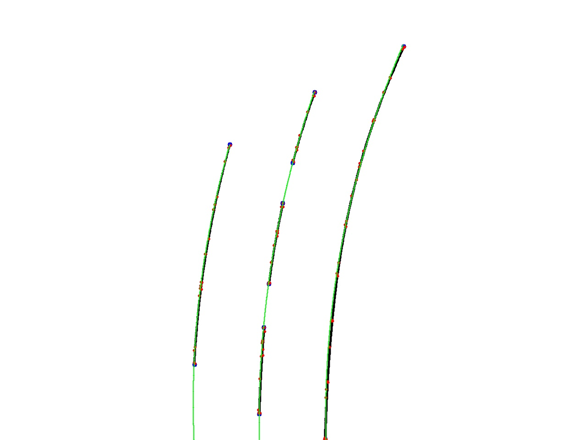
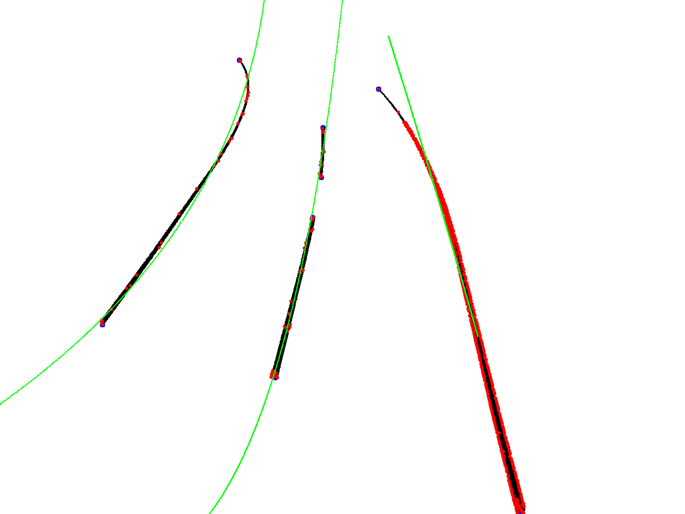

## How to clone
* clone in your ROS workspace: ``` ~/catkin_ws/scr/: git clone https://gitlab.com/zfinnolab/lane-detection-assist/laneregression.git ```

## How to build
* ``` ~/catkin_ws$: source /opt/ros/melodic/setup.bash ```
* ``` ~/catkin_ws$: source devel/setup.bash ```
* build the project: ``` ~/catkin_ws$: catkin_make ```

## How to run
start roscore master:
* ``` ~/catkin_ws$: roscore ```

for each step open new terminal and paste ``` source devel/setup.bash ``` in ``` /catkin_ws$ ```
* ``` ~/catkin_ws/src/laneregression$: rosrun laneregression lanedetection_dummy.py ``` (talker simuates interface from LaneDetection)
* ``` ~/catkin_ws$: rosrun laneregression laneregression-node.py ```  (main node)
* ``` ~/catkin_ws$: rosrun laneregression laneassist_dummy.py ``` (listener simulates interface to LaneAssist)


## How LaneRegressions works

preliminary work:
* in LaneDetection an algorithm for Persepctive Transformation was implemented (to get the top-down view)
* the cluster points of a few frames were written to a file

LaneDetection dummy publisher:
* retrieve test points from the file and publishes successively the frames with the clusterpoints on a topic

LaneRegression:
* subscribe to topic
* look for related cluster (dashed line consists of several clusters)
* for each line cluster run Ramer–Douglas–Peucker algorithm  (calculates less points)
* order new points
* calculate x(t) and y(t) functions (third degree polynomials)
* build a message which contains information about functions and publish it on a topic

LaneAssist dummy subscriber:
* subscribe to topic and parse information

## Result example
Here is an example image of one frame.
* black lines: raw cluster
* blue points: start and end points of raw cluster 
* red points: points calculated by Ramer–Douglas–Peucker algorithm
* green lines: illustration of calculated functions


Result without Perspective transformation:

